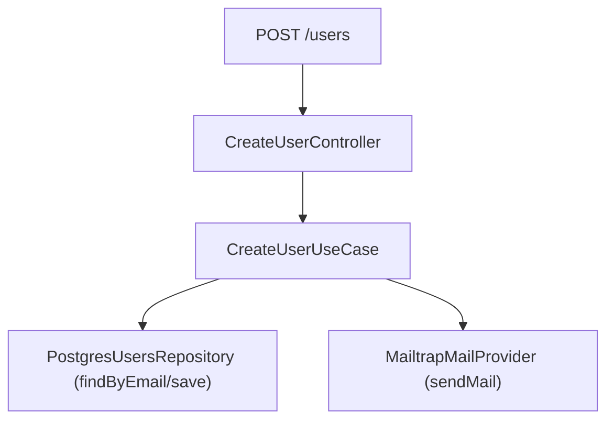

# API Node Solid

Este projeto é uma API de exemplo construída com Node.js, TypeScript e Express, seguindo princípios de Clean Architecture e SOLID.

## Visão Geral

O projeto implementa um fluxo de criação de usuário, com separação clara de responsabilidades entre entidades, repositórios, provedores, casos de uso e controllers. Inclui envio de e-mail de boas-vindas ao novo usuário.

---

## Arquitetura e Estrutura

- **Entidades**: Representam os modelos de domínio (ex: `User`).
- **Repositórios**: Interfaces e implementações para persistência de dados (`IUsersRepository`, `PostgresUsersRepository`).
- **Provedores**: Serviços externos, como envio de e-mail (`IMailProvider`, `MailtrapMailProvider`).
- **Casos de Uso**: Lógica de negócio central (ex: `CreateUserUseCase`).
- **Controllers**: Recebem requisições HTTP e acionam os casos de uso (`CreateUserController`).
- **Rotas**: Definem os endpoints da API (`routes.ts`).

---

## Fluxo Principal: Criação de Usuário

1. **Rota**: `POST /users` chama o controller de criação de usuário.
2. **Controller**: Recebe os dados, chama o caso de uso.
3. **Caso de Uso**: Verifica duplicidade, cria usuário, salva e envia e-mail.
4. **Repositório**: Salva usuário (atualmente em memória).
5. **Provedor de E-mail**: Envia e-mail de boas-vindas via Mailtrap.

### Diagrama do Fluxo



---

## Pontos Positivos

- Separação de responsabilidades (Clean Architecture).
- Uso de interfaces para facilitar testes e trocas de implementação.
- Envio de e-mail integrado (Mailtrap).
- Tratamento básico de erros.

## Pontos de Atenção

- **Persistência**: Usuários são salvos apenas em memória. Implemente persistência real para produção.
- **Validação**: Não há validação de formato de e-mail ou senha.
- **Segurança**: Senha salva em texto puro. Use hash (ex: bcrypt) em produção.
- **Testes**: Adicione testes automatizados para garantir qualidade.

---

## Como rodar

1. Instale as dependências:
   ```bash
   yarn install
   # ou
   npm install
   ```
2. Inicie o servidor:
   ```bash
   yarn dev
   # ou
   npm run dev
   ```

---

## Contribuição

Sinta-se à vontade para abrir issues ou pull requests!
